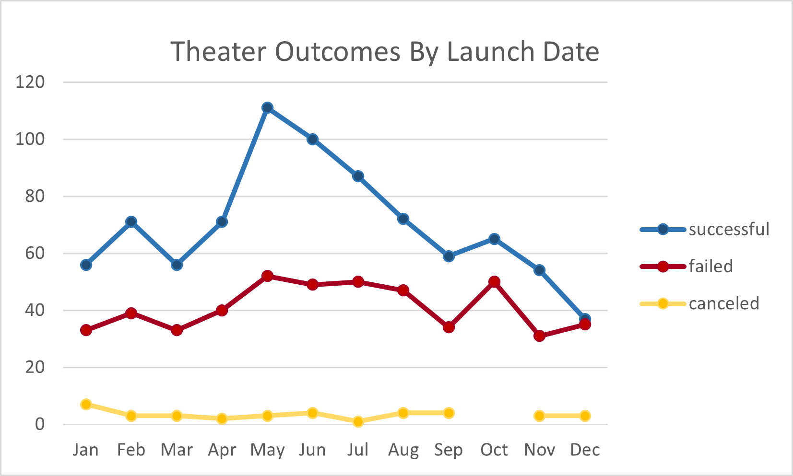

# Kickstarting with Excel

## Overview of Project

### Purpose
The purpose of this analysis is to compare campaign success rates and funding goals to their respective launch dates to inform Louise what factors will help her succeed on her upcoming play, "Fever." Our goal is to help Louise gain the most amount of success by analyzing past successful, failed and canceled plays.
## Analysis and Challenges

In my analysis, it is apparent that most plays performed better during the summer months, and did not perform nearly as well during the winter months. By looking at the charts, we will notice a pattern of successful to failed plays in the summer. The success rate skyrockets, and the failed rate remained pretty stangnant when compared to other months. We can also see that plays with lower goal ranges did significantly better than the plays with much higher goal ranges. This could potentially be due to accessibility to resources to reach that goal. Louise would have a higher success rate if she aimed for a lower goal amount on her play, "Fever", and aimed for a release date during the summer months. Louise could maximize her success rate if she were to release "Fever" anywhere from May-July with a goal range of less than $1,000 up to $5,000.
### Analysis of Outcomes Based on Launch Date

### Analysis of Outcomes Based on Goals

### Challenges and Difficulties Encountered

## Results

- What are two conclusions you can draw about the Outcomes based on Launch Date?

One of the most obvious outcomes of the launch dates is that there is a higher success rate in the Summer months. If we take a look at the theater outcomes by launch date chart, you will also see an increase in cancellations in the Winter months. This could be due to the Summer months being a less busy time for most families, meaning more time available to go see a live play.
- What can you conclude about the Outcomes based on Goals?

By looking at the outcomes based on goals chart, we notice that there is a higher success rate in the goal range of less than $1000. It seems as though you will suceed better with a more obatinable goal, rather than a larger sum amount. A larger total goal rate is less likely to succeed when compared to a smaller goal amount.
- What are some limitations of this dataset?

A possible limitation that may exist is amount of plays per goal range. The total amount of plays in the higher goal range does not nearly equate to to the amount of plays in the lower goal range, thus limiting exact percentages on success rates. We could not be certain that a higher goal range has a lower success rate unless we compare the same amount of plays as a lower goal range. For example, there are 186 plays with a goal of less than $1000, compared to a total of 12 plays with a goal of more than $50,000. Because of this discrepancy, we can't guarantee that these findings will be completely accurate.
- What are some other possible tables and/or graphs that we could create?

Another type of chart that could potentially be useful would be a column chart, as it could simplify the way we look at each category and what they represent. For most people, this chart might be easier to comprehend. I have attached an example below. 
